# Kernel Build Action For Lancelot & Merlin

## Step-by-step guide to use

  
<i>Click to open</i>

>### 1.
>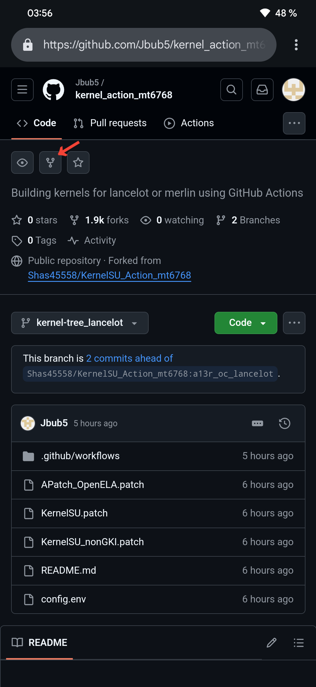

>### 2.
>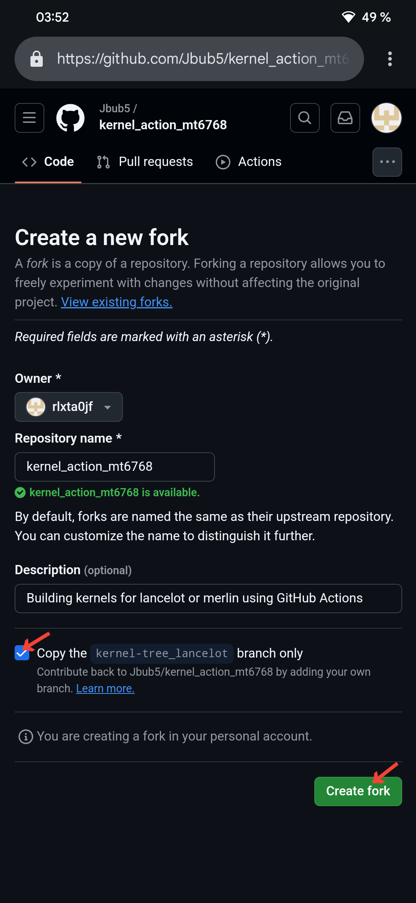
> **Note:** Unselect `Copy the kernel-tree_lancelot branch only` if you are building for merlin.

>### 3.
>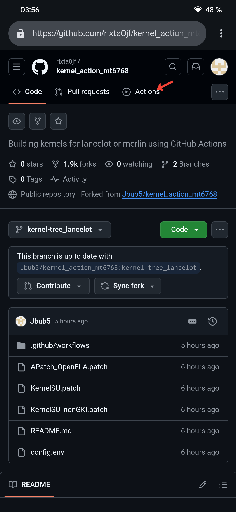

>### 4.
>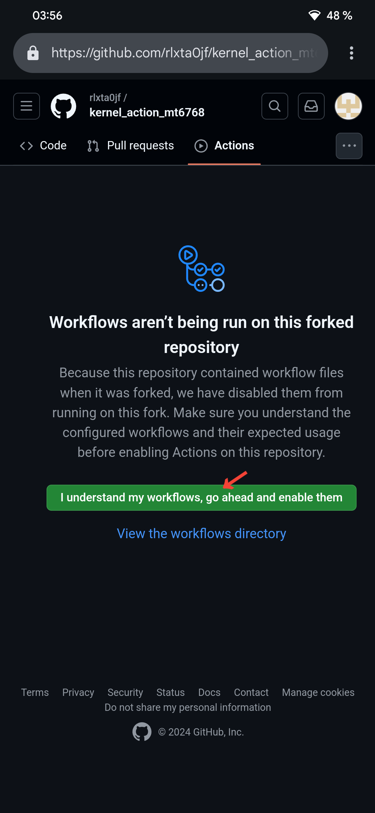

>### 5.
>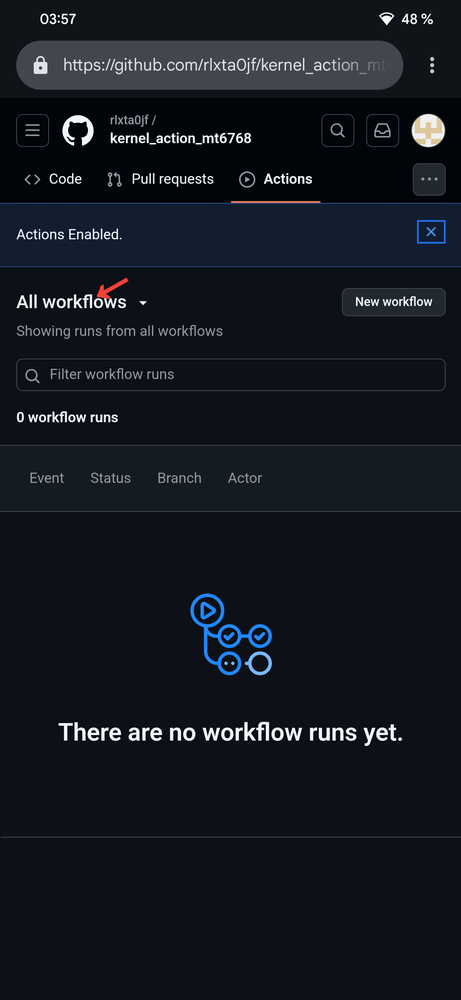

>### 6.
>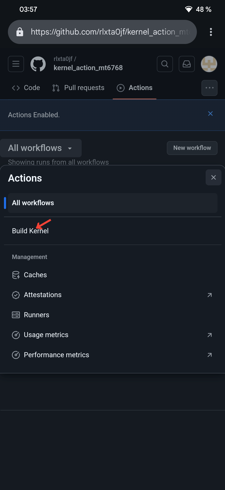

>### 7.
>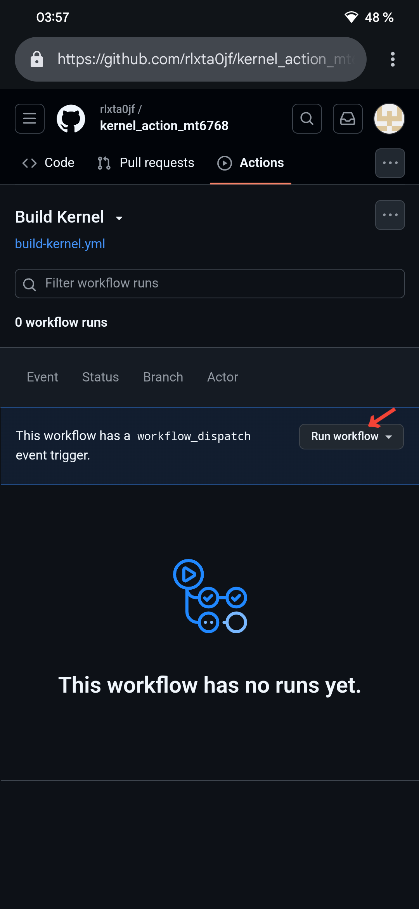

>### 8.
>

>### 9.
>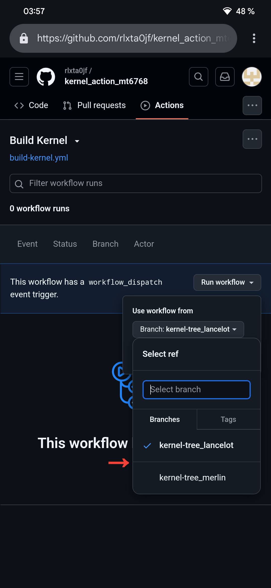

>### 10.
>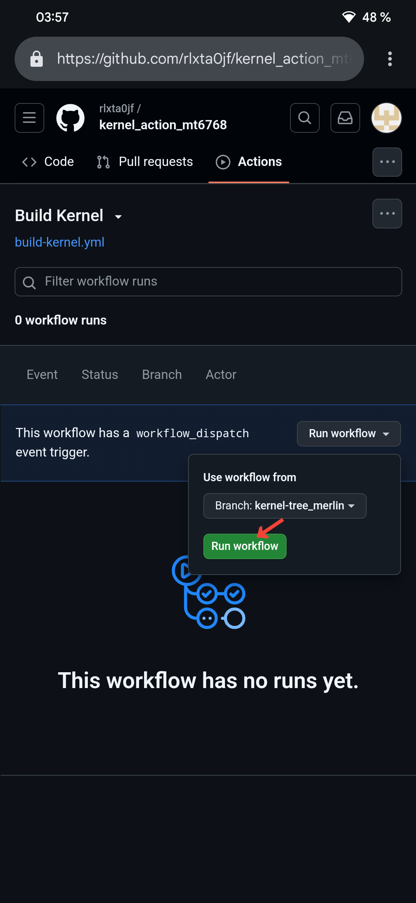

>### 11.
>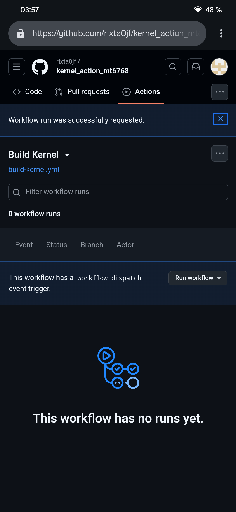
> **Note:** Reload this page if the yellow circle does not appear.

>### 12.
>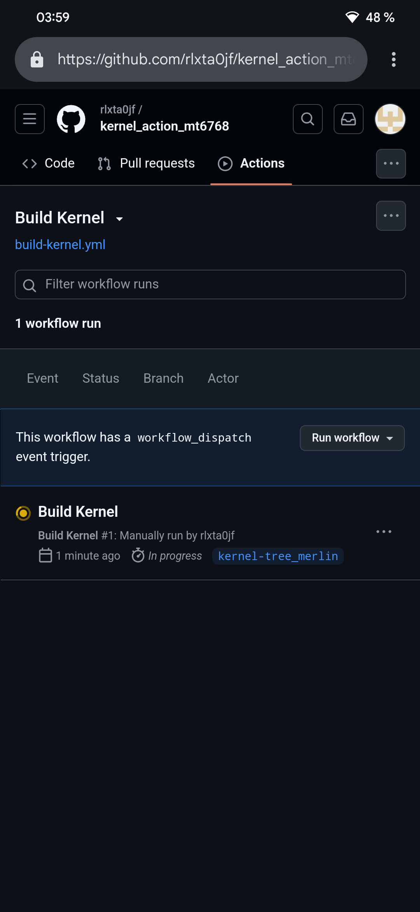

>### 13.
>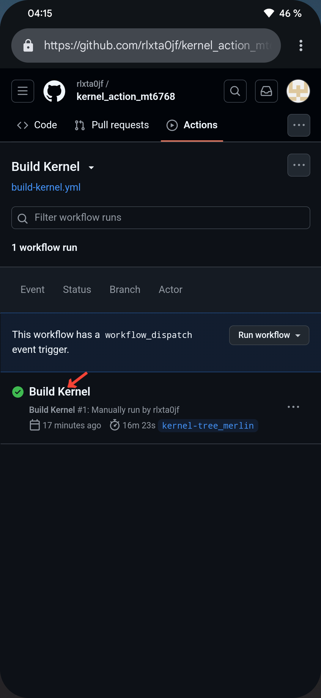

>### 14.
>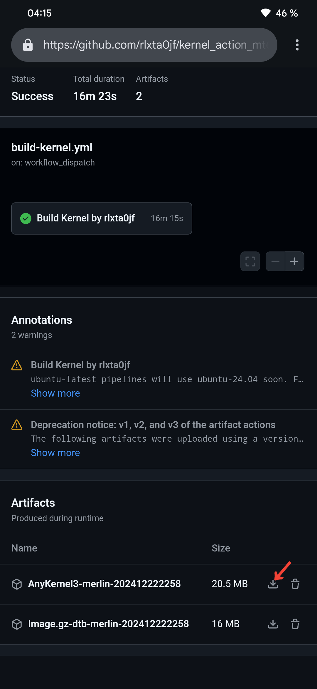
  

 

## Options Guide
> All options are located in [config.env](config.env)

### KERNEL_SOURCE

Change this to your kernel repository url.

For example: `https://github.com/Jbub5/android_kernel_xiaomi_mt6768`

### KERNEL_SOURCE_BRANCH

Change this to your kernel branch.

For example: `kernel-tree`

### KERNEL_CONFIG

Change this to your kernel defconfig name.

For example: `lancelot_defconfig`

### KERNEL_IMAGE_NAME

Change this to the kernel binary that needs to be flashed, generally consistent with `BOARD_KERNEL_IMAGE_NAME` in your AOSP device tree.

For example: `Image.gz-dtb`

Common names include `Image`, `Image.gz`.

### KERNEL_ARCH

For example: `arm64`

### ENABLE_KERNELSU

Enable KernelSU for troubleshooting kernel failures or compiling the kernel separately.

#### KERNELSU_TAG

[KernelSU 1.0 no longer supports non-GKI kernels](https://github.com/tiann/KernelSU/issues/1705). The last supported version is [v0.9.5](https://github.com/tiann/KernelSU/tree/v0.9.5), please make sure to use the correct branch.

Select the branch or tag of KernelSU:

- ~~main branch (development version): `KERNELSU_TAG=main`~~
- Latest TAG (stable version): `KERNELSU_TAG=v0.9.5`
- Specify the TAG (such as `v0.5.2`): `KERNELSU_TAG=v0.5.2`

#### KSU_EXPECTED_SIZE and KSU_EXPECTED_HASH

Customize the size and hash values of the KernelSU manager signature, if you don't need to customize the manager then please leave them empty or fill in the official default values:

`KSU_EXPECTED_SIZE=0x033b`

`KSU_EXPECTED_HASH=c371061b19d8c7d7d6133c6a9bafe198fa944e50c1b31c9d8daa8d7f1fc2d2d6`

You can type `ksud debug get-sign <apk_path>` to get the size and hash of the apk signature.

#### KSU_REVERT

This will revoke the commit that dropped non-GKI support.

#### ADD_KPROBES_CONFIG

Inject parameters into the defconfig automatically.

#### KSU_HOOKS_PATCH

If kprobe does not work in your kernel, then try enabling this option, this will automatically modify kernel source code to support KernelSU.  

See also: [Intergrate for non-GKI devices](https://kernelsu.org/guide/how-to-integrate-for-non-gki.html#manually-modify-the-kernel-source)

### ADD_OVERLAYFS_CONFIG

This option provides support for overlayfs. Inject parameters into defconfig automatically.

### ADD_APATCH_SUPPORT

This option provides support for overlayfs. Inject parameters into defconfig automatically.

#### FIX_APATCH_OPENELA

This option provides fix for https://github.com/bmax121/APatch/issues/400.

### USE_CUSTOM_CLANG

You can use a non-official clang such as [proton-clang](https://github.com/kdrag0n/proton-clang).

#### CUSTOM_CLANG_SOURCE

> Fill in a link that includes `.git` if it is a git repository.

Git repository or direct chain of compressed zip files is supported.

#### CUSTOM_CLANG_BRANCH

For example: `main`

### CLANG_BRANCH

Due to [#23](https://github.com/xiaoleGun/KernelSU_Action/issues/23), we provide an option to customize the Google main branch. The main ones include:
| Clang Branch |
| ------------ |
| master |
| master-kernel-build-2021 |
| master-kernel-build-2022 |

Or other branches, please search for them according to your own needs at https://android.googlesource.com/platform/prebuilts/clang/host/linux-x86.

#### CLANG_VERSION

Enter the Clang version to use.

| Clang Version | Corresponding Android Version | AOSP-Clang Version |
| ------------- | ----------------------------- | ------------------ |
| 12.0.5        | Android S                     | r416183b           |
| 14.0.6        | Android T                     | r450784d           |
| 14.0.7        |                               | r450784e           |
| 15.0.1        |                               | r458507            |
| 17.0.1        |                               | r487747b           |
| 17.0.2        | Android U                     | r487747c           |

Generally, Clang12 can compile most of the 4.14 and above kernels. My MI 6X 4.19 uses r450784d.

### ENABLE_GCC_AOSP
Enables usage of standart GCC toolchain.

#### ENABLE_GCC_ARM64

Enable GCC 64C cross-compiler.

#### ENABLE_GCC_ARM32

Enable GCC 32C cross-compiler.

### EXTRA_CMDS

Some kernels require additional compilation commands to compile correctly. Generally, no other commands are needed, so please search for information about your kernel. Please separate the command and the command with a space.

For example: `LLVM=1 LLVM_IAS=1`

### USE_CUSTOM_ANYKERNEL3

Can use custom AnyKernel3.

#### CUSTOM_ANYKERNEL3_SOURCE

> If it is a git repository, please fill in the link containing `.git`

Supports direct links to git repositories or zip compressed packages.

#### CUSTOM_ANYKERNEL3_BRANCH

Customize the warehouse branch of AnyKernel3.

### NEED_DTBO

Upload DTBO. Some devices require it.

### BUILD_BOOT_IMG

> Added from previous workflows, view historical commits

Build boot.img, and you need to provide a `Source boot image`.

### SOURCE_BOOT_IMAGE

As the name suggests, it provides a boot image source system that can boot normally and requires a direct chain, preferably from the same kernel source and AOSP device tree as your current system. Ramdisk contains the partition table and init, without which the compiled image will not boot up properly.

For example: `https://raw.githubusercontent.com/xiaoleGun/KernelSU_action/main/boot/boot-wayne-from-Miku-UI-latest.img`

### DISABLE_LTO

LTO is used to optimize the kernel but sometimes causes errors.

### DISABLE_CC_WERROR

Sometimes even a harmless warning breaks the build.

### REMOVE_UNUSED_PACKAGES

To clean unnecessary packages and free up more disk space. If you need these packages, please disable this option.

### ENABLE_CCACHE

Enable the cache to make the second kernel compile faster (or slower).

## Thanks

- [AnyKernel3](https://github.com/osm0sis/AnyKernel3)
- [AOSP](https://android.googlesource.com)
- [KernelSU](https://github.com/tiann/KernelSU)
- [xiaoxindada](https://github.com/xiaoxindada)
